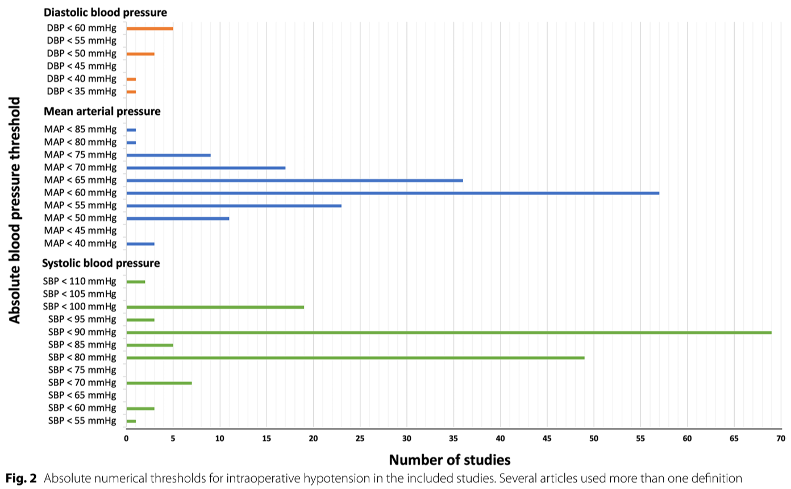
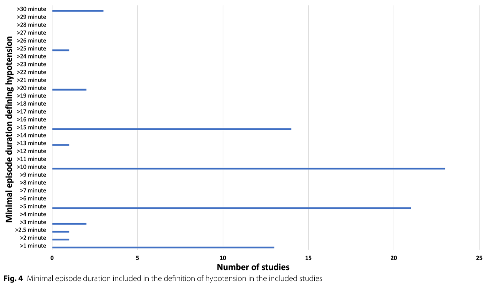

```{r setup, include=FALSE}
source("R/setup.R")

knitr::opts_chunk$set(echo = TRUE,
                      message = FALSE,
                      warning = FALSE)
```

\newpage
\large

```{r, echo = FALSE}
# load the data
data <- load_data()
```

# Patient cohort

* 1039 patients with Coronary Artery Disease
  * `r 100 * data$gender %>% mean() %>% round(3)` % female
  * Average age: `r data$age %>% mean() %>% round(2)` years


* Patients underwent off-pump coronary bypass surgery
* Jan 1, 2018 - Dec 31, 2021
* 5 patients converted to on-pump during surgery were excluded

# Definition of Hypotension

* Defined through 
  * critical value of the mean blood pressure (BPM)
  * time below the critical value
  * commonly used definition: **> 10 minutes with BPM < 60 mmHg** 
  
  (Weinberg et al.: Reported definitions of intraoperative hypotension in adults undergoing non-cardiac
  surgery under general anaesthesia: a review; BMC Anesthesiology (2022). [See next slide])
  
# Primary outcome

* Composite outcome consisting of
  * Stroke 
  * Myocardial infarction 
  * Renal complications
  * Delirium
  
# Major secondary outcomes
* Length of ICU stay
* Ventilation time

\newpage

\newpage
{width=0.45\textwidth}

\vspace{0.5cm}

{width=0.45\textwidth}
\newpage

\newpage

# Impact of time below critical threshold
## Split total time below threshold into 10 buckets by deciles
## Compute fraction of composite outcome per bucket

\vspace{2.5cm}

```{r, echo = FALSE, out.width = "100%", fig.align = "center"}
data <-
  data %>% 
  dplyr::mutate(bpm_lowest_decile = .deciles(bpm_lowest),
                total_time_below_60_decile = .deciles(total_time_below_60),
                total_time_below_50_decile = .deciles(total_time_below_50),
                max_consec_time_below_60_decile = .deciles(max_consec_time_below_60),
                max_consec_time_below_50_decile = .deciles(max_consec_time_below_50))

data %>% outcome_per_decile("total_time_below_60", "figures/total_60.png")
data %>% outcome_per_decile_fancy("total_time_below_60", "figures/total_60_split.png")
```

\vspace{1cm}

&rarr; Average time below 60 mmHg: `r data$total_time_below_60 %>% mean() %>% round(3)` minutes

&rarr; Median time below 60 mmHg: `r data$total_time_below_60 %>% median() %>% round(3)` minutes

&rarr; Max. time below 60 mmHg: `r data$total_time_below_60 %>% max() %>% round(3)` minutes

&rarr; Lower quartile: `r data$total_time_below_60 %>% quantile(0.25) %>% round(3)` minutes

&rarr; Upper quartile: `r data$total_time_below_60 %>% quantile(0.75) %>% round(3)` minutes

&rarr; Patients without time below 60: `r sum(data$total_time_below_60 == 0)`

&rarr; $\leq$ 10 minutes corresponds to the commonly used time-threshold to define hypotension

\newpage
\small

# Binary treatment definition: $\leq$ 10 minutes below BPM 60 mmHg
## Distribution of patient characteristics in the treated vs. untreated population
### Median [Q1, Q3] for continuous variables, n (%) for binary variables
```{r, echo = FALSE, results = "hide"}
t <- t1(data = data %>% Hmisc::upData(labels = labels, print = FALSE),
        treatment = "max_10_total_below_60",
        name_untreated = "Prolonged hypotension [BPM < 60 mmHg for more than 10 minutes]",
        name_treated = "No prolonged hypotension [BPM < 60 mmHg for at most 10 minutes]",
        numerical_vars = c(confounders_numerical, "es"), # manually add the EuroScore II
        categorical_vars = c(confounders_binary, "myocardial_inf_preop"),  # manually add MI
        var_labels = labels,
        matching_summary = NULL)
```

```{r echo=FALSE, results='asis'}
options(knitr.kable.NA = '')

t <-
  t %>% 
  # some manual reordering
  dplyr::slice(1:7, 9:nrow(t), 8) %>% # put EuroScore to the end
  dplyr::add_row(" " = "Confounders", .before = 2) %>% 
  dplyr::add_row(" " = "Additional variables", .before = nrow(t))

t %>% readr::write_delim('tables/t1.csv', delim = ";")

t %>% 
  knitr::kable(digits=3) %>% 
  kableExtra::row_spec(c(0, 2, nrow(t) - 2), bold = TRUE) %>% 
  kableExtra::column_spec (1, border_right = TRUE) %>%
  kableExtra::column_spec(2:3, width = "3.5 cm", border_right = TRUE) %>% 
  kableExtra::kable_styling(latex_options = "striped")
```

\newpage

# Propensity score matching
```{r, echo = FALSE}
formula <- as.formula(
  paste0(treatment,
         " ~ ",
         paste0(c(confounders_numerical, confounders_binary),
  collapse = " + "))
)
```

* Logistic regression for propensity score estimation
* _k_-Nearest Neighbor Matching with a _caliper_
* Test _k_ between 1 and 5 and _caliper_ between 0.05 and 0.1
* Select combination which minimizes the standardized mean difference of the worst-balanced confounder

\vspace{0.3cm}
\footnotesize

```{r}
matching_results <- optimize_matching(
  data = data, 
  formula = formula, 
  distance = "glm",
  link = "logit",
  method = "nearest",
  caliper = seq(0.05, 0.1, by = 0.01),
  ratio = 1:5,
  m.order = "largest",
  criterion = "max_abs_std_mean_diff",
  criterion_secondary = "avg_abs_std_mean_diff",
  estimand = "ATT"
)
```

```{r, echo = FALSE, results = 'hide'}
matching_results$data_matched %>% readr::write_delim("data/opcab_matched.csv", delim = ";")
```

\normalsize
\vspace{0.3cm}

### Love plot (Standardized mean differences prior to vs. post matching)

```{r, echo=FALSE, out.width="75%", fig.align = "center"}
love_plot(data_matched = matching_results$data_matched,
          data_unmatched = data,
          confounders = c(confounders_numerical, confounders_binary),
          confounder_labels = labels,
          output_path = "figures/love_plot.png",
          treatment = treatment)
```

\newpage
\footnotesize
\blandscape

# Estimating Odds Ratios for binary outcomes
```{r, echo = FALSE, results = "hide"}
odds_ratios <- or_table(
  vars = outcomes_binary,
  labels = labels,
  data_unmatched = data %>% Hmisc::upData(labels = labels, print = FALSE),
  data_matched = matching_results$data_matched %>% Hmisc::upData(labels = labels, print = FALSE),
  treatment_name = treatment
)
```

\renewcommand{\arraystretch}{1.5}

```{r, echo = FALSE, results = "asis"}
# adjust names
names(odds_ratios) <- c(" ",
                        "No prolonged hypotension",
                        "Prolonged hypotension", 
                        "No prolonged hypotension",
                        "Prolonged hypotension", 
                        "OR",
                        "CI", 
                        "p")

odds_ratios %>% readr::write_delim('tables/odds_ratios.csv', delim = ";")

options(knitr.kable.NA = '')

odds_ratios %>% 
  knitr::kable(digits=3) %>% 
  kableExtra::column_spec (c(1, 3, 5), border_left = FALSE, border_right = TRUE) %>%
  kableExtra::row_spec(0, bold = TRUE) %>% 
  kableExtra::row_spec(1, bold = TRUE, hline_after = TRUE) %>%
  kableExtra::column_spec(c(2, 4, 6), width = "1.9 cm") %>% 
  kableExtra::column_spec(c(3, 5), width = "1.9 cm", border_right = TRUE) %>% 
  kableExtra::kable_styling(latex_options = "striped")
```

\newpage
\small

# Estimating Mean Differences for numerical outcomes
```{r, echo = FALSE, results = "hide"}
mean_diffs <- mean_diff_table(
  vars = outcomes_numerical,
  mean_std = c("blood_products_total",
               "red_cells_intraop",
               "platelets_intraop",
               "plasma_intraop",
               "red_cells_postop",
               "platelets_postop",
               "plasma_postop"),
  labels = labels,
  data_unmatched = data %>% Hmisc::upData(labels = labels, print = FALSE),
  data_matched = matching_results$data_matched %>% Hmisc::upData(labels = labels, print = FALSE),
  treatment_name = treatment
)
```

\scriptsize
\renewcommand{\arraystretch}{1.75}

```{r, echo = FALSE, results = "asis"}
# adjust names
names(mean_diffs) <- c(" ",
                       "No prolonged hypotension",
                       "Prolonged hypotension",
                       "No prolonged hypotension ",
                       "Prolonged hypotension ",
                       "Mean Diff.",
                       "CI", 
                       "p")

mean_diffs %>% readr::write_delim('tables/mean_diffs.csv', delim = ";")

options(knitr.kable.NA = '')

mean_diffs %>% 
  knitr::kable(digits=3, escape = FALSE) %>% 
  kableExtra::column_spec (c(3, 5), border_right = TRUE, width = "2.5 cm") %>%
  kableExtra::column_spec (c(2, 4), width = "2.5 cm") %>%
  kableExtra::column_spec(1, width = "5 cm", border_right = TRUE) %>% 
  kableExtra::column_spec(6, width = "1.25 cm") %>% 
  kableExtra::column_spec(8, width = "1 cm") %>% 
  kableExtra::row_spec(0, bold = TRUE) %>% 
  kableExtra::row_spec(1, bold = TRUE, hline_after = FALSE) %>%
  kableExtra::kable_styling(latex_options = "striped")
```
\elandscape
\large
\renewcommand{\arraystretch}{1.75}

# Key preliminary findings

* Definition of hypotension as **> 10 minutes with BPM < 60 mmHg**  in accordance with the literature

* Avoiding hypotension significantly ...
  * improves the risk of the composite outcome
  * reduces the ventilation time
  * shortens the ICU stay

in the propensity-matched analysis
